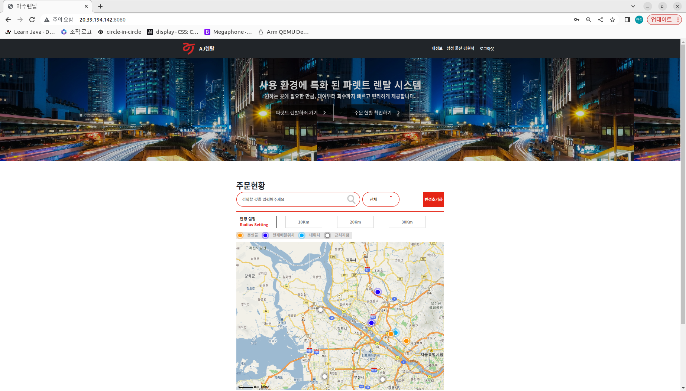
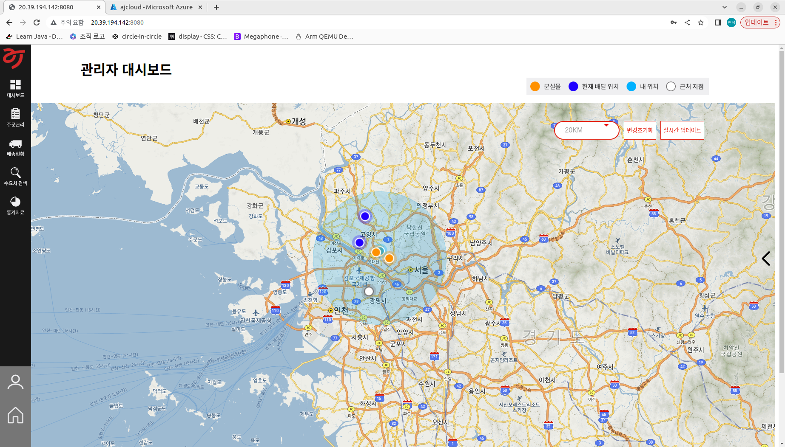

# AJpallet_web

## 환경설정
***
### 서버 설정

    
   1. DB는 MySql를 사용 했습니다.
   2. datasource.url ,username, password 를 개인에 맞게 변경 해주세요

### url 설정

1. 해당 텝에 있는 파일에 있는 url을 자신의 환경에 맞게 변경하세요

## 실행 방법
***
1. Server
   1. AZprojectPallet-0.0.1-SNAPSHOT.jar 특정 폴더에 이동해주세요
   2. java -jar AZprojectPallet-0.0.1-SNAPSHOT.jar 해당 파일에서 명령어 입력

2. Android
    1. .apk 파일을 다운 받고 여러 보안 무시한후 설치 완료후 실행 능
    2. 각 apk를 동시에 설치 및 사용 불가 하나의 어플을 업데이트 하는 형식으로 사용가 

## View
***

### 공통
#### 1.메인

#### 2.로그인

### 유저
#### 1. 유저 메인

#### 2. 파렛트 상품 보기

#### 3. 장바구니 및 주문

#### 4. 예약확인

#### 달력 바 클릭

#### 5. 내정보

### 관리자
#### 1. 관리자 메인

#### 지점 마커 클릭

#### 2. 주문관리

#### 3. 배송현황

## 기능
***

### 유저
#### 배송현황 보기

#### 카카오 맵을 이용하여 주문한 파렛트 위치를 알수 있다.

#### 특정 범위 안에 있는 파렛트 위치를 필터링 할 수 있다.

#### 특정 파렛트 타입만 필터링 하여 볼 수 있다.

이외 기능인 주문 하기, 주문예약 확인 및 삭제 기능이 있다 (View참고)

### 관리자
#### 파렛트 현황 보기

#### 모든 고객의 파렛트 현황을 해당 맵에 띄워 관제 할 수 있다.
#### 범위설정하여 기준에 맞는 파렛트만 보이게 할 수 있다.
#### 변경초기화로 설정전 화면을 볼 수 있고, 실시간 업데이트를 통해 파렛트 좌표를 가져올 수 있다.

#### 특정 파렛트 ID를 입력하면 해당 파렛트만 표시 되어 볼 수 있다.

이외 기능인 유저의 주문 내역과 배송현황을 확인 및 삭제를 할 수 있는 기능이 있다 (View참고)

